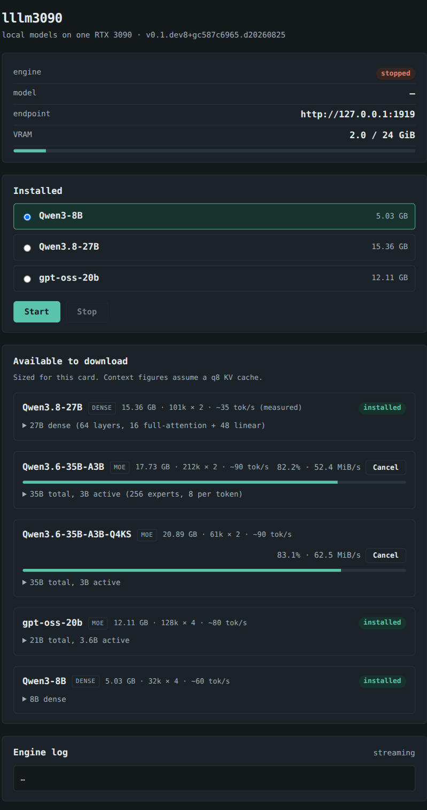

# lllm3090

Local LLM serving for a single consumer GPU, with a browser control panel.

A llama.cpp engine, a web UI on loopback that starts and stops it and downloads
models, and a curated model list where every entry has been checked to fit 24 GB
with a usable context left over — recomputed for whatever card it finds.

## Install

Debian 13 or a derivative (Ubuntu 24.04 / 26.04), an NVIDIA GPU — the catalogue
is curated for 24 GB and computed for whatever you have — and the driver already
working:

```bash
# uv, if you do not have it: https://docs.astral.sh/uv/getting-started/installation/
curl -LsSf https://astral.sh/uv/install.sh | sh

uv tool install lllm3090
lllm3090 setup
```

`setup` checks the hardware, installs the one apt package the engine needs,
fetches a pinned llama.cpp build and starts the panel as a user service. It is
safe to re-run and skips whatever is already done.

It touches nothing outside `$HOME` except `libvulkan1`, and downloads **no model
weights** — you pick those from the panel.

Then open <http://127.0.0.1:8080>, download `Qwen3-8B` (5 GB) to prove the
install works, and `Qwen3.6-35B-A3B` (17.7 GB) for real use — at 126 tok/s
it is the fastest model that also reaches a full 262k context, which is what
agentic work needs. `gpt-oss-20b` decodes faster still, at 160, in half the
room.

## Use

```bash
lllm3090 models          # what exists, what fits, what is downloaded
lllm3090 start Qwen3.6-35B-A3B
lllm3090 status
lllm3090 claude          # launch Claude Code against the local model
lllm3090 tui             # the panel, drawn in the terminal
lllm3090 stop            # free the VRAM
```

The engine exposes both the OpenAI API (`/v1/chat/completions`) and Anthropic's
(`/v1/messages`) on `127.0.0.1:1919`, so Claude Code and OpenAI-compatible
clients both work against it without a translation proxy.

## What travels to another card, and what does not

The catalogue makes two kinds of claim, and they do not travel together.

**Whether a model fits, and what context it leaves,** is arithmetic over
capacity. The GPU is detected and the figures are computed for *that* card, so
they are right on a 4090, on a 32 GB 5090, on a 96 GB PRO 6000, and on a 16 GB
5080 where most of the catalogue does not fit at all. An unrecognised card gets
a profile synthesised from what `nvidia-smi` reports rather than falling back to
3090 assumptions.

**How fast it runs** is a measurement, true of the card it was taken on and
nowhere else. Every tokens-per-second figure here was measured on an RTX 3090.
Elsewhere they are labelled `(other card)` and are never scaled by a bandwidth
ratio — that produces a guess which prints like a measurement.

So the name is the card it was built and measured on, not a limit on where it
runs. `lllm3090 bench` is how another card gets real numbers of its own; see
[other cards](https://gilesknap.github.io/lllm3090/explanations/other-cards.html).

## Documentation

<https://gilesknap.github.io/lllm3090>

If you are weighing this against Ollama, LM Studio or `llama-swap`, that
comparison is written down: [what else is out there, and what this does that
they do not](https://gilesknap.github.io/lllm3090/explanations/landscape.html)
— including when you should use one of them instead.

## The panel



Engine state and VRAM at the top, the models you have with start/stop, the
curated list with what fits this card and what it will do, and the engine log
streaming underneath. Downloads run in the background with progress, and resume
from a part file if interrupted.

On a machine with no browser within reach of it — a text console, an SSH
session without a tunnel — `lllm3090 tui` draws the same panel in the terminal.
